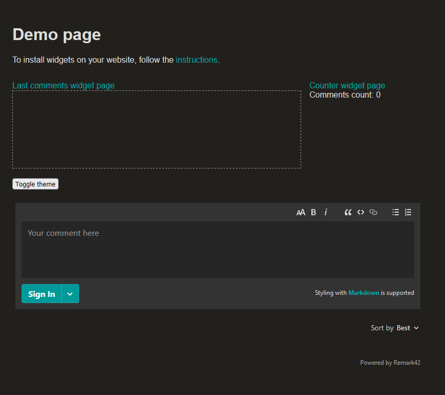
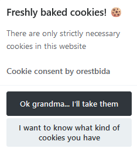
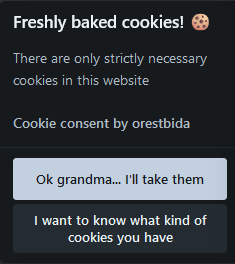
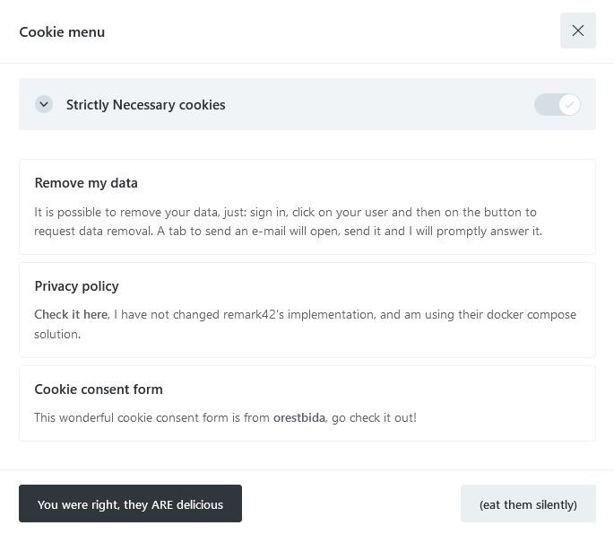
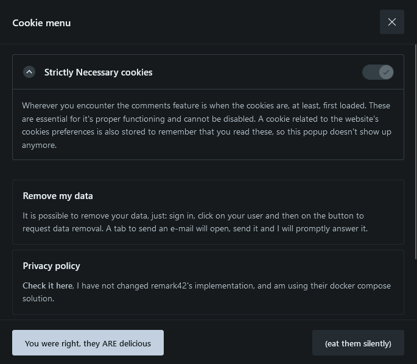

## Why Remark42

Because it is lightweight and privacy-focused. The theme that I am using for this website, Stack, built on Hugo Framework, provides a bunch of [comments integrations](https://stack.jimmycai.com/config/comments). Remark42 was one of them. That was it, I wanted ease of integration and something non-invasive.

I considered using Cactus, because it uses [Matrix](https://matrix.org/) - highly recommend you check it out. But then, when I finally set everything up with the quick start, it didn't look that good. Glad I explored it, though. this way I learned about the existence of Matrix... Decentralised communication! Are you kidding me? That sounds awesome!

I digress, anyway, Remark42! It's promissing, it has a bunch of neat features and integrations. The cookies that it stores are pretty low key, everything is hashed and ecrypted, and minimal information is used... At least that is what they say... But the code's open-source, so you can [check it out](https://github.com/umputun/remark42).

## Initial setup

It is very easy to get it up-and-running, because with the Stack theme I didn't even have to integrate the frontend. I'm not going to guide you through the same steps they have on their page. Needless to say that, if you are running the backend on a machine other than your pc, you might have to adapt your interpretation when it comes to referencing the host backend.

### Backend

I went with the docker solution, [find the steps here](https://remark42.com/docs/getting-started/installation/). Because I am running this in my home server, I had to expose a port on the configuration, and kept it simple with only the anonymmous authentication on, example of the `docker-compose.yml`:

```yaml
version: "2"

services:
  remark:
    # remove the next line in case you want to use this Docker Compose file separately
    # as otherwise it would complain for absence of Dockerfile
    build: .
    image: umputun/remark42:latest
    container_name: "remark42"
    hostname: "remark42"
    restart: always

    logging:
      driver: json-file
      options:
        max-size: "10m"
        max-file: "5"

    # uncomment to expose directly (no proxy)
    ports:
      - "5005:8080" # host:container

    environment:
      - REMARK_URL=http://127.0.0.1 # localhost
      - SITE=davidsales.pt # you can set any value here
      - SECRET=abcd12345 # make sure to set a strong secret for the JWT tokens
      - ALLOWED_HOSTS=http://localhost:1313
      # available client auth
      # -> anon
      - AUTH_ANON=true
    volumes:
      - ./var:/srv/var
```

As you can see, there are still some comments from their example yaml file. You don't really need to set `ALLOWED_HOSTS` at this point, but if you do, make sure to set it as the website's url where you're embedding remark42 (the hugo cli launches the local website on port 1313). This var will later on be important, to add an **extra layer of security**, as it will **only allow embedding on the websites defined there** (you can set multiple, comma-separated, values).

You should be able to access the demo by typing `http://127.0.0.1:5005/web/`. Here's an example from my page:


### Frontend

As I mentioned previously, I am using a theme from the Hugo Framework which allows me to easily embbed remark42. So I only had to change the `params.toml` to enable commenting, and also match the backend configuration:

```toml
[comments]
enabled = true
provider = "remark42"

(...)

[comments.remark42]
host = "http://127.0.0.1:5005"
site = "davidsales.pt"
locale = "pt-pt"
```

I was running Remark42's backend on another machine, so I actually changed the host to that machine's ip plus the 5005 port. Actually, we'll get into that next.

## That was it! ... Not quite

Of course that wasn't everything that we needed to do to have it fully working, we still need to somehow be able to connect to the backend, when loading our website (this case davidsales.pt). But, after you setup external access, you can just explore the other wonderful features that Remark42 has, such as: administration, user authentication with multiple providers, notifications, ...

## Setup external access to the backend

This part is totally up to you. We need to somehow be able to access this from the WWW, and I am just going to tell you what I did.

I have a machine with Apache2 serving as a reverse proxy, the connections are forwarded to it and it routes them to the appropriate place. I have setup certificates with certbot on this machine, for my domain. And I created a subdomain to accommodate this backend. If you check this page's configuration, you might find the link `https://remark42.davidsales.pt` somewhere. And you should only be able to access some pages (hopefully 😆).

I'm not going into detail about this, as it will increase this post's size by a lot. Comment below or e-mail me if you'd like to know how I set all this networking part out.

With this last paragraph you can already assume that I am reverse proxying requests from my subdomain to the local container directly, and that the connection is secured (as it uses HTTPS). Just make sure anyone on the internet can access:
- `/web/privacy.html`, as it contains the privacy statement
- `/web/markdown-help.html`, that helps users with markdown
- `/web/iframe.html`, that actually lets you embbed remark42 in the website
- Any `css`, `svg` or `jpeg` file under `/web/`
- As well as everything under `/auth` and `/api`, to allow for requests to the backend
I think you can lock the rest!

Now, **don't forget to set the secret environment variable** if you haven't, on the backend. Use some online service if you have to generate it, [example](https://jwtsecret.com/generate).

After you can access it externally, make sure to change the `REMARK_URL` on the backend config to the frontfacing url, and from the frontend that is embbedding it as well. In my case it was `https://remark42.davidsales.pt`.

## Fun part begins: Customizing it!

Now you can setup anything you want, that remark42 provides. I just setup Github, Google and Microsoft. Anonymmous authentication was already setup from the beginning. Here's an example of what my yaml file looks like at this point:

```yaml
version: "2"

services:
  remark:
    build: .
    image: umputun/remark42:latest
    container_name: "remark42"
    hostname: "remark42"
    restart: always

    logging:
      driver: json-file
      options:
        max-size: "10m"
        max-file: "5"

    ports:
      - "5005:8080"

    environment:
      - REMARK_URL=https://remark42.davidsales.pt
      - SECRET=[redacted]
      - SITE=davidsales.pt
      - ALLOWED_HOSTS=https://remark42.davidsales.pt,https://davidsales.pt,http://localhost:1313
      - ADMIN_SHARED_ID=[redacted]
      - ADMIN_SHARED_EMAIL=[redacted]
      # available client auth
      # -> anon
      - AUTH_ANON=true
      # -> github
      - AUTH_GITHUB_CID=[redacted]
      - AUTH_GITHUB_CSEC=[redacted]
      # -> google
      - AUTH_GOOGLE_CID=[redacted]
      - AUTH_GOOGLE_CSEC=[redacted]
      # -> Microsoft
      - AUTH_MICROSOFT_CID=[redacted]
      - AUTH_MICROSOFT_CSEC=[redacted]
    volumes:
      - ./var:/srv/var
```

Once you're ready, you can start thinking about publishing this. But before that, I think you should really consider to at least try being GDPR compliant. I don't know if I fully am, but I tried by adding a cookie consent modal thingy 😆

## Cookie Consent modal

If you search for some integration in Hugo, you might find [this one](https://hugocodex.org/add-ons/cookie-consent/). It's okay, but to be honest it looked ugly. So I searched a little bit more and [stumbled upon this one](https://cookieconsent.orestbida.com/), doesn't it look clean?

It is very simple to set up, it took a little elbow grease to properly set everything, but it was really easy to integrate with the theme I am using, even though it is not officially supported! I might contribute to stack with this addition 😊 This framework is really cool!

### Setup the consent modal

I [followed the steps here](https://cookieconsent.orestbida.com/essential/getting-started.html) went with the CDN hosted version, as it seemed like the simplest one. To actually add it to the pages, and here comes the easibility of using Stack and Hugo, I just created the files that I had to overwrite, and changed where I wanted. It's that simple, anything that you don't explicitly add to the theme, will be loaded from it's defaults. To be fair, I don't know if this is Hugo's feature or Stack's, but it is certainly a bit of both.

We have to add the:
- Stylesheet
  - I created `/layouts/partials/head/custom.html` and just added the link tag needed
- Modal information setup on a script
  - I created `/static/js/cookieconsent-config.js` with my configuration, which is just text with the information I want to display there
    - You can find an example on the steps that I linked in this section
- Script tag for the modal (to display it)
  - As I wanted it to be in the footer, I created `/layouts/partials/footer/custom.html` and added the script tag needed
    - Referencing it in the `src` attribute with `{{ .Site.BaseURL }}js/cookieconsent-config.js`, because this is how we can reference the contents of the static folder

I also wanted to change it's style to match the theme toggle that Stack has, so I copied the `/ts/colorScheme.ts` from [Stack's github](https://github.com/CaiJimmy/hugo-theme-stack), and changed it accordingly. [CookieConsent mentions how we can toggle the dark theme](https://cookieconsent.orestbida.com/advanced/ui-customization.html#color-schemes), so I just added the respective lines on the code that toggles the theme, and retrieved the cookie that stores the theme preference on startup (so the correct theme is applied when it is loaded). [You can check the file on the repo of this website](https://github.com/MestreSales/mestresales.github.io/tree/master/ts/colorScheme.ts) if you are interested.

Apart from all of these changes to accomodate the cookie consent on my site, I wasn't fully comfortable yet with the privacy policy not being linked anywhere. So I also copied the full footer file to be able to edit it, to `/layouts/partials/footer/footer.html` and added a link to the privacy policy.

Here's how it ended up looking. Neat, right?

 

 

## Quirks

### Remark42 deleteme

This works from the standpoint of the user. If they want to delete all their user data, they can click on themselves, after signing in, and click on the respective button. It'll open a new tab to send an e-mail, but the URL linked isn't the proper one. So the admin can't really process the request with one click. Instead:
- They have to copy the token id generated
- They have to be signed in with their admin account
- Make a proper GET `/api/v1/admin/deleteme?token={token}`
- Replace the `{token}` with the one from the email
- Add the headers according to their session cookies
  - `X-XSRF-TOKEN: {XSRF-TOKEN}`
  - `Cookie: JWT-{JWT}`
- Make the request

### Remark42 to match the theme

This is done by default, as Stack officially supports Remark42. But I find that the sorting box text is not that readable when the theme is Dark. I have had some trouble in trying to change it, and gave up.

## Final words

This was quite a lot of work, mostly in the networking + security part, because I want to have something reliable. The rest was quite straightforward, there were just a lot of new concepts and things to explore. Was a really fun thing to investigate, and it opened some new doors. Leave a comment letting me now what you thought, or send me an e-mail!